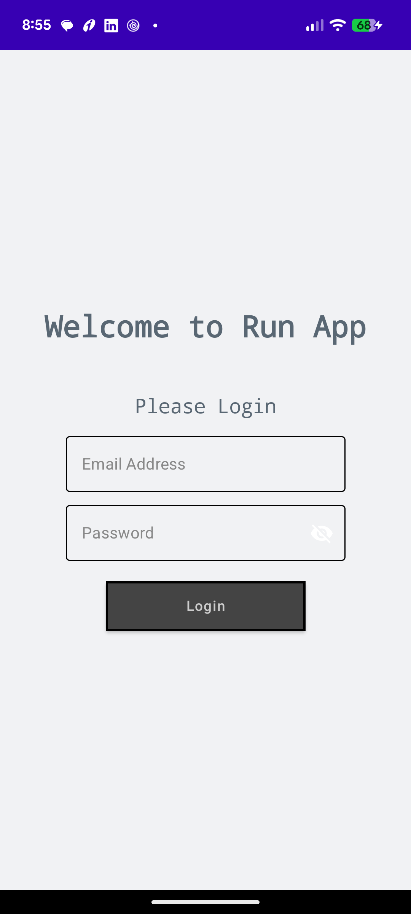
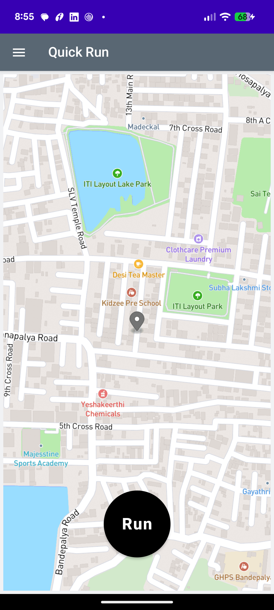
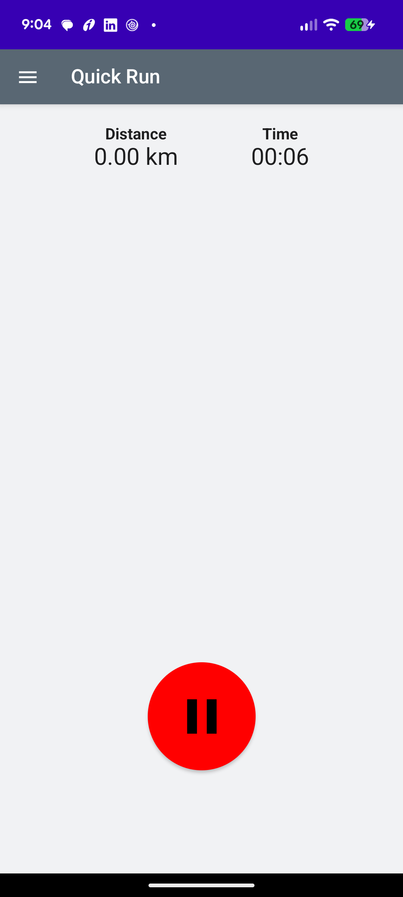
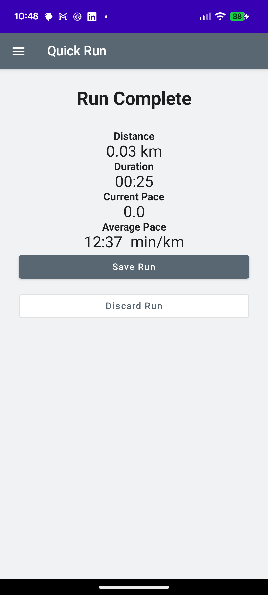

# Run App

An Android running application built with **Kotlin** and **Jetpack Compose**. The app provides a Quick Run experience with GPS-based location tracking, run timing, distance tracking, pause/resume and post-run actions.

## Features

- User login
- Quick Run screen
- GPS/location availability check
- Map display using Mapbox
- Configurable run countdown
- Run timer
- Distance tracking
- Pause and resume run
- Stop run and post-run flow
- Save or discard run flow
- MVVM-based architecture
- Hilt dependency injection
- Kotlin Coroutines and StateFlow for UI state management

## Screenshots

<table>
  <tr>
    <td align="center">
      
      <br/>
      <b>Login</b>
    </td>
    <td align="center">
      
      <br/>
      <b>Quick Run</b>
    </td>
  </tr>
  <tr>
    <td align="center">
      
      <br/>
      <b>Running</b>
    </td>
    <td align="center">
      
      <br/>
      <b>Post Run</b>
    </td>
  </tr>
</table>

## Architecture

The application follows an MVVM-style architecture:

```text
UI (Jetpack Compose)
        |
        v
ViewModel
        |
        v
Repository
        |
        +------------------+
        |                  |
        v                  v
   Backend APIs       Location/GPS
```

UI state is maintained using `StateFlow`, with the run lifecycle represented using states such as:

```text
PRE_RUN
   |
   v
COUNTDOWN
   |
   v
RUNNING
   |
   +------> PAUSED
   |          |
   |          v
   |       RUNNING
   |
   v
POST_RUN
```

## Tech Stack

- **Kotlin**
- **Jetpack Compose**
- **MVVM**
- **Hilt**
- **Kotlin Coroutines**
- **StateFlow**
- **Mapbox**
- **Android Location APIs**
- **Retrofit** for backend communication

## Project Structure

```text
app/
└── src/
    └── main/
        └── java/
            └── com.example.Run_App/
                ├── data/
                │   ├── model/
                │   └── repository/
                ├── Navigation/
                ├── login/
                └── ui/
                    ├── main/
                    ├── run/
                    │   └── quickRun/
                    └── settings/
```

## Quick Run Flow

```text
Quick Run
    |
    v
Check Location Permission
    |
    v
Check GPS
    |
    v
Pre-Run Screen
    |
    v
Countdown
  3 -> 2 -> 1
    |
    v
Active Run
    |
    +---- Pause ----> Paused ----> Resume
    |
    v
Stop
    |
    v
Post Run
    |
    +---- Save
    |
    +---- Discard
```

## Setup

1. Clone the repository.
2. Open the project in Android Studio.
3. Configure the required Mapbox token.
4. Configure the backend API endpoint.
5. Build and run the application on an Android device or emulator.

## Future Improvements

- Persist completed runs locally.
- Upload GPS track data to the backend.
- Calculate current and average pace from GPS points.
- Add run history.
- Add user-configurable countdown settings.
- Add background location tracking.
- Add detailed post-run statistics.